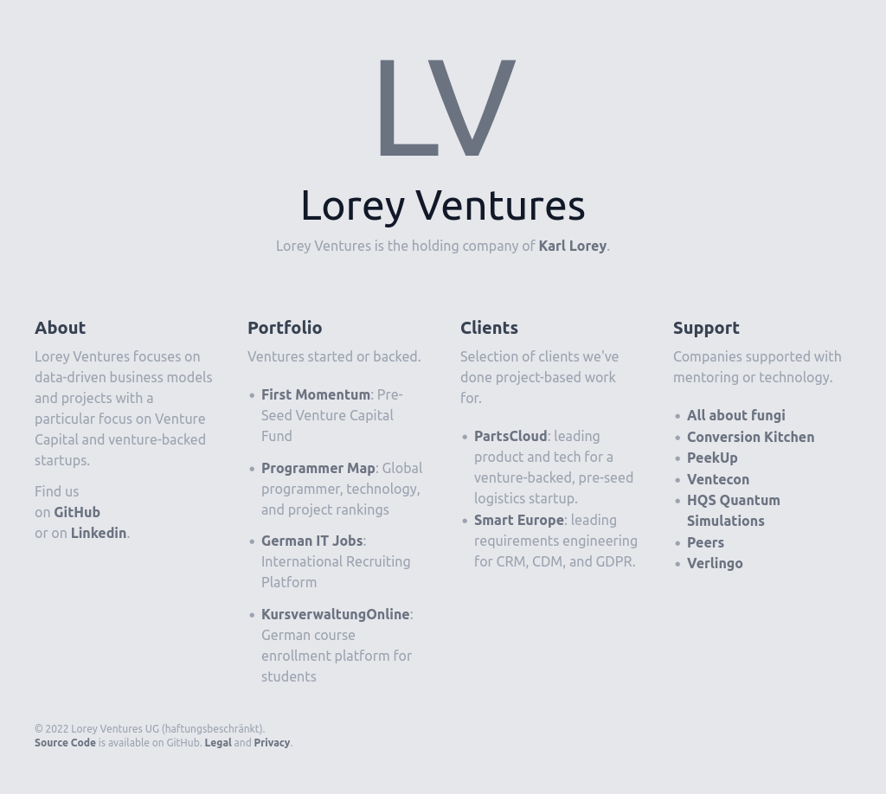

# Minimalist Portfolio Website with Gatsby
A minimalist website with and about, portfolio, and references section.
Created with Gatsby, React, and Tailwind.
Deployed on Github Pages as [loreyventures.com](https://loreyventures.com), the website of Lorey Ventures.

Here's a preview:



## Development
To develop, check out this repository and run
```
docker-compose build
docker-compose up
```

## Deployment
Deployment is defined in `.github` and done automatically on every push.

## Sources
- [Gatsby in Docker](https://blog.konnor.site/javascript/setting-up-gatsby-with-docker/)
- [Deploy with Github pages](https://dabarov.github.io/blog/gatsby-blog-github-pages/)